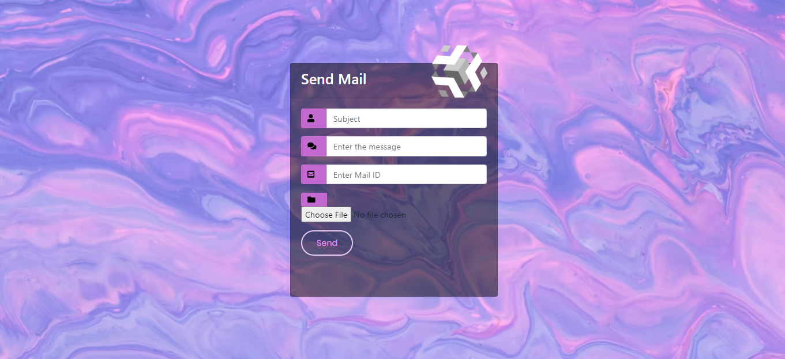

# Email-Sending-Script
<h3>HOME PAGE</h3>

<h3>SEND EMAIL PAGE</h3>

<h3>Technologies Used</h3>
<ul>
  <li>Flask Framework</li>
  <li>Imp Libraries : SMTP and MIME</li>
  </ul>

``` 
from flask import Flask,render_template,request
import smtplib
from email.mime.multipart import MIMEMultipart
from email.mime.text import MIMEText
import os
from email.mime.base import MIMEBase
from email import encoders

```
